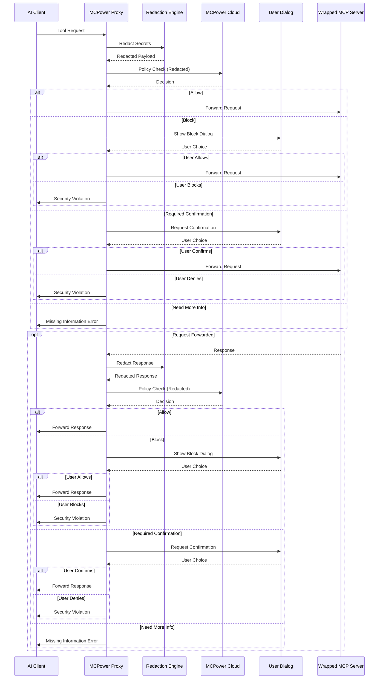

# MCPower Proxy Server

Transparent MCP wrapper with security middleware for real-time policy enforcement and visual monitoring.

## Architecture

MCPower Proxy Server is built as a transparent 1:1 MCP wrapper that intercepts all communication between AI clients and MCP servers. The architecture includes:

- **Transparent Proxy Layer**: 1:1 wrapper that directly intercepts and wraps MCP servers
- **Security Middleware**: Intercepts all MCP operations
- **Redaction Engine**: Client-side secrets detection before cloud submission
- **Policy Enforcement**: Cloud-powered policy decisions with local user confirmation
- **MCP Monitoring**: Visual monitoring logs for all MCP operations

## Core Components

### wrapper/

- `server.py`: Proxy server creation
- `middleware.py`: Security middleware implementation (pre/post operation interception)

### modules/redaction/

- Client-side redaction engine (Gitleaks + PII regex patterns)
- Redacts secrets/PII from intercepted data BEFORE sending to MCPower cloud
- Fully offline, deterministic, idempotent
- Key files: `redactor.py`, `gitleaks_rules.py`, `pii_rules.py`

### modules/apis/

- `security_policy.py`: HTTP client for MCPower cloud policy API

### modules/logs/

- `logger.py`: Structured logging
- `audit_trail.py`: Visual monitoring trail

### modules/ui/

- Cross-platform confirmation dialogs (macOS, Windows, Linux)
- Used for user confirmation when policy requires it or blocks operations

### modules/utils/

- `cli.py`: CLI argument parsing
- `config.py`: Configuration management
- `ids.py`: Event/session ID generation
- `json.py`: JSON/JSONC parsing utilities
- `mcp_configs.py`: MCP server config extraction

## Operation Flow



**Flow Steps:**

1. **Initialize**: Proxy wraps target MCP server config
2. **Request Interception**: Security middleware intercepts operation
3. **Local Redaction**: Redact PII/secrets from request data
4. **Policy Check**: Send redacted payload to MCPower cloud for analysis
5. **User Confirmation**: If needed, show dialog for user decision
6. **Forward Request**: If allowed, forward to wrapped MCP server
7. **Response Interception**: Repeat redaction + policy check for response
8. **Forward Response**: If allowed, return to AI client

## CLI Usage

```bash
mcpower-proxy --name <wrapper-name> --wrapped-config <mcp-config-json>
```

**Configuration:**

- Config file location: `~/.mcpower/config.json`

## Development

**Requirements:**

- Python ~3.11
- Dependencies in `pyproject.toml`

## Security Model

- Secrets and PII are redacted client-side before any data is sent to MCPower cloud for policy analysis
- Visual monitoring of AI<->MCP communication
- Cloud policy engine analyzes redacted payloads only
- User has final control via confirmation dialogs
